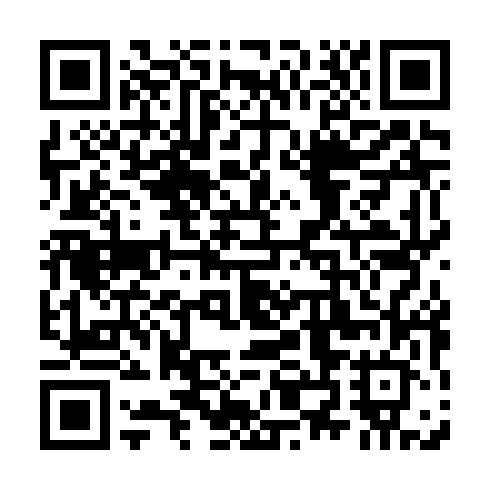

# 🔐 QR Secret Tool

  

---

## 📌 About

**QR Secret Tool** is a professional-grade tool that allows you to hide secret messages inside QR codes with military-grade encryption. Perfect for secure communication and data hiding.

---

## ✨ Features

| Feature | Description |
|---------|-------------|
| 🔐 AES-256-GCM | Military-grade encryption |
| 📱 QR Generation | Create QR codes instantly |
| 🔓 Decryption | Decrypt encrypted QR codes |
| 🎭 Hacker Style | Professional hacker interface |
| 💻 Cross Platform | Windows, Linux, Mac |
| 📝 Plain QR | Create non-encrypted QR codes |

---

## 🎯 Tags

`#QRCode` `#Encryption` `#AES256` `#Security` `#Privacy` `#HackerTool` `#CyberSecurity` `#Steganography` `#DataHiding` `#Python` `#Crypto` `#DarkNet` `#HasnainDarkNet` `#SecretMessages` `#Cryptography`

